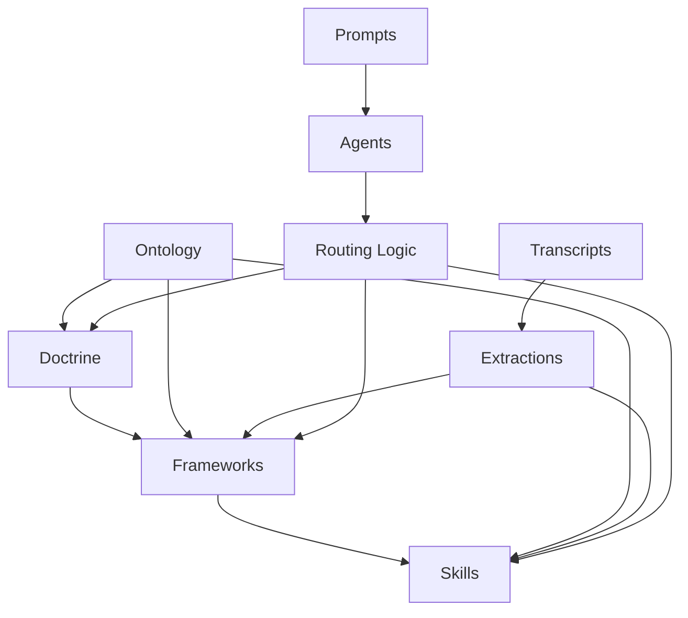

# Founder Intelligence System Map

## Architectural relationship model

## Relationship interpretation

- **Doctrine** defines interpretation boundaries and strategic worldview.
- **Frameworks** translate doctrine into operational reasoning systems.
- **Skills** execute specific cognitive operations inside frameworks.
- **Ontology** keeps terms, entities, and relationships semantically stable.
- **Transcripts/Extractions** provide source signals and structured memory.
- **Agents/Prompts** operationalize routing and execution against canonical assets.

## Operating loop

1. Capture source material in transcripts.
2. Extract structured intelligence artifacts.
3. Map artifacts to ontology terms.
4. Apply doctrine-aware frameworks.
5. Run skill-level reasoning operations.
6. Return outputs into organizational memory.
